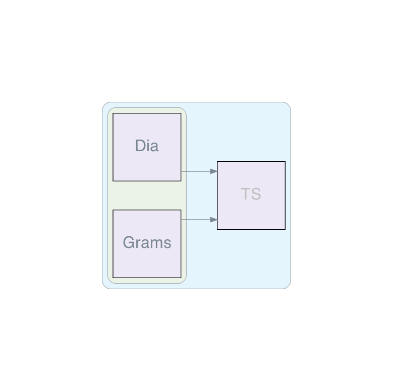
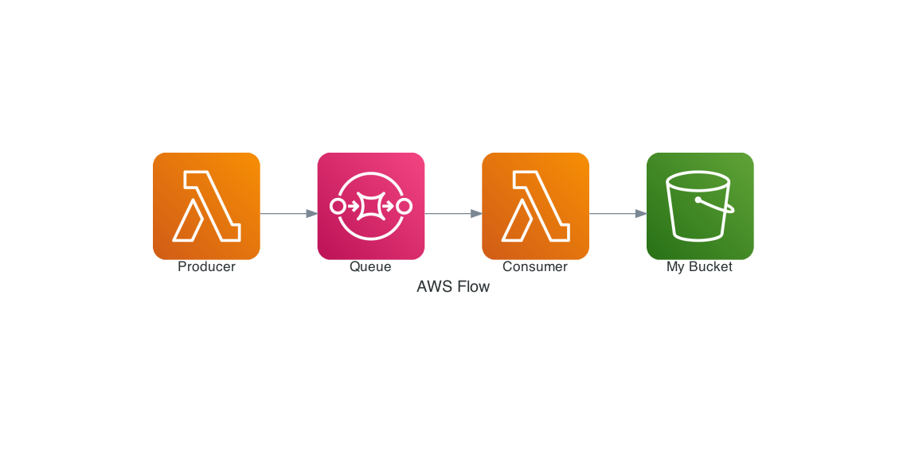

# diagrams-ts



`TypeScript`-Port of the python library [`diagrams` by mingrammer](https://diagrams.mingrammer.com/).
Creating architecture diagrams directly from code.

## About

Inspired by the nice visuals and easy to read syntax of the original library, this port tries to provide the same for `type script`.
Styles and the `Nodes` are taken from the original library. It also uses `graphviz` for the final graph rendering.

> Disclaimer:
> This project is still under development, not finished and the api can have breaking changes between versions. Use with care.

## Installation and Requirements

In order to create `svg`, `png` or `webp` output you'll need to install [graphviz](https://graphviz.org/download/). This package expects `dot` cli of `graphviz` to be available in the `path`.
You can check this by running:

```sh
dot -v
```

This package expects a `node` version >= 14.

Install this package by running:

```sh
npm install diagrams-ts

# or when using yarn

yarn add diagram-ts
```

## Getting started

Import the library, choose a provider, write your code and generate your first diagram.

main.ts:

```ts
import * as diagrams from "../src/diagrams";

const {
  providers: { aws: {compute:{Lambda},integration:{SQS},storage:{S3}} },
  createDiagram,
  diagram,
} = diagrams;

const awsFlow =
};

(async () => {
  try {
    await createDiagram({
      label: "AWS Flow",
      fileName: "./generated-assets/aws-flow.png",
    })(() => {
  const producer = aws.compute.Lambda("Producer");
  const queue = aws.integration.SQS("Queue");
  const consumer = aws.compute.Lambda("Consumer");
  const bucket = aws.storage.S3("My Bucket");

  return diagram`${producer}>>${queue}>>${consumer}>>${bucket}`;});
  } catch (error) {
    console.log(error);
  }
})();
```

If you'll run it will create the "aws-flow.png" in the output folder:



For more examples of the syntax you can take look at the examples folder. In order to run them, you can use `ts-node` e.g.:

```sh
# In the project root:

yarn ts-node ./examples/show-diagram.ts

```

## Known Issues

- Merging edges has a bug
- "Direct rendering" is not yet possible
- Node Label positioning
